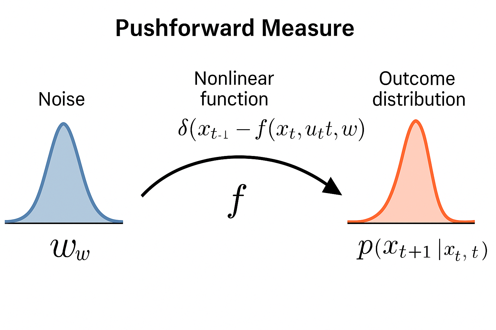

**对应章节:** [https://pierrelucbacon.com/rlbook/ssm/](https://pierrelucbacon.com/rlbook/ssm/)

# 用于决策的动态模型

$$
(\mathbf{x}_0,\ \{\mathbf{u}_t\},\ \{\mathbf{d}_t\}) \ \longmapsto\ \{\mathbf{x}_t,\ \mathbf{y}_t\}_{t=0:T},
$$

-  **模型目的**：不仅要描述相关性，更要描述系统如何**随时间演化**，以及在我们选择的**控制输入**下如何响应（用于规划、评估策略与交互式学习）。  
- **轨迹生成器视角**：给定初始状态、控制序列与外生扰动，模型应能**前向滚动**出状态与观测的轨迹；这是决策与控制的“骨架”。  
- **控制 vs. 扰动**：区分我们能施加的 **控制输入**（u）与必须适应的 **外生驱动**（d），明确“能控制的部分 vs. 被动的部分”。  
- **两大设计压力**：  
  1) **对输入的可响应性**：模型要暴露与决策相关的“杠杆”；  
  2) **记忆管理（状态）**：用一个紧凑变量 **state** 概括“到目前为止的重要信息”，以便逐步仿真与控制。  
- **状态空间观**：把动力学写成状态推进（离散或连续时间），并允许与估计器、控制器**模块化组合**；线性化是**为透明与速度做的建模折中**，不是“世界本来线性”。  
- **离散 vs. 连续时间**：实现大多离散（采样/执行），但**连续时间**有助于表达物理假设、跨尺度推理与守恒/不变性；两种表述可相互转化（数值离散化、零阶保持或插值等）。  

 
# 状态空间视角

- **核心思想**：  
  大多数动力学模型（无论来自物理还是数据驱动）都可以写成**状态空间形式**。  
  其中：
  - 状态 $\mathbf{x}$：包含了预测和控制所需的全部“记忆”；  
  - 控制 $\mathbf{u}$：是我们能施加的决策输入；  
  - 外部驱动 $\mathbf{d}$：是外界的扰动；  
  - 观测 $\mathbf{y}$：是我们能测得的输出。  

- **离散时间与连续时间**：  
  - 离散时间：数字控制器以固定步长采样与决策。  
 $\mathbf{x}_{t+1} = f_t(\mathbf{x}_t, \mathbf{u}_t), \qquad \mathbf{y}_t = h_t(\mathbf{x}_t, \mathbf{u}_t).$
  - 连续时间：物理过程以微分方程形式演化。  
 $\dot{\mathbf{x}}(t) = f(\mathbf{x}(t), \mathbf{u}(t)), \qquad \mathbf{y}(t) = h(\mathbf{x}(t), \mathbf{u}(t)).$

 两者可通过**数值离散化**或**零阶保持**和**插值**互相转化。  

- **物理系统的混合特性**：  
  实际中，控制软件发出离散命令（数字信号），经过 DAC 转为模拟电压驱动系统；  
  传感器信号经 ADC 离散化后传入控制器。  
  因此，**连续动力学 + 离散执行**几乎无处不在。  

- **为什么仍需连续时间建模？**  
  - 显式地表达物理假设（如能量守恒、不变性）；  
  - 连接领域知识（微分方程形式）；  
  - 支持多时间尺度推理；  
  - 理解离散化误差与系统结构。  

- **线性化表示**：  
  若 $f$ 和 $h$ 线性，则：  

$\dot{\mathbf{x}} = A\mathbf{x} + B\mathbf{u}, \qquad \mathbf{y} = C\mathbf{x} + D\mathbf{u}.$

  线性假设并非“世界是线性的”，而是一种**透明性与速度的建模折中**。  
  对机器学习者而言，它类似于 **RNN**：状态是隐藏向量，输入是控制信号，输出层是读出函数。

- **频域与时域的视角**：  
  经典控制通过 **Laplace / Z-变换** 将微分方程转为代数方程以分析稳定性；  
  而在学习与仿真中，**时域状态空间形式** 更通用、可扩展。  

# 确定性动力学示例：暖通空调控制  

- **情景背景：**  
  蒙特利尔的冬天，室外温度 -20°C，室内恒温系统试图维持舒适。  
  系统包括空气、墙体、加热设备、外界天气，是一个典型的**热动力系统（thermal dynamical system）**。

- **目标：**  
  用最少的参数捕捉建筑热量流动的主要物理机制。
---

### 1. 单区单容模型（1R1C 模型）

- 假设整个房间是一个整体的热容体，温度随时间变化满足：
$$
\dot{\mathbf{x}}(t) = -\frac{1}{RC}\mathbf{x}(t) + \frac{1}{RC}\mathbf{d}(t) + \frac{1}{C}\mathbf{u}(t).
$$
  其中：
  - \(x(t)\)：室内温度  
  - \(u(t)\)：加热功率（控制输入）  
  - \(d(t)\)：室外温度（扰动）  
  - \(R\)：热阻（墙体隔热能力）  
  - \(C\)：热容（空气热容量）  

- **解释：**  
  该系统是连续时间线性系统，可写为：  

$$
\dot{\mathbf{x}}(t) = \mathbf{A}\mathbf{x}(t) + \mathbf{B}\mathbf{u}(t) + \mathbf{E}\mathbf{d}(t), \quad \mathbf{y}(t) = \mathbf{C}\mathbf{x}(t),
$$

---

### 2. 双区双容模型（2R2C 模型）

- 墙体也具有热容，应纳入建模，形成“空气 + 墙体”耦合系统：
$$
\mathbf{A} = \begin{bmatrix}
-\frac{1}{R_{\text{ia}}C_{\text{air}}} & \frac{1}{R_{\text{ia}}C_{\text{air}}} \\
\frac{1}{R_{\text{ia}}C_{\text{wall}}} & -\left(\frac{1}{R_{\text{ia}}} + \frac{1}{R_{\text{wo}}}\right) \frac{1}{C_{\text{wall}}}
\end{bmatrix},
\quad
\mathbf{B} = \begin{bmatrix} \frac{1}{C_{\text{air}}} \\ 0 \end{bmatrix},
\quad
\mathbf{E} = \begin{bmatrix} 0 \\ \frac{1}{R_{\text{wo}}C_{\text{wall}}} \end{bmatrix},
\quad
\mathbf{C} = \begin{bmatrix} 1 & 0 \end{bmatrix}.
$$

  写成状态空间形式：  
  \[
  \dot{x} = A x + B u + E d, \quad y = Cx
  \]

- **矩阵解释：**
  - \(A_{11}\)：空气对墙体的热损失  
  - \(A_{12}\)：空气从墙体获得热量  
  - \(A_{21}\)：墙体从空气获得热量  
  - \(A_{22}\)：墙体对空气和外界的综合热损失  

- **物理含义：**  
  墙体储热 → 延迟加热响应（热惯性）。  
  系统更平滑、更稳定，对扰动响应更慢但更稳健。

---

### 3. 控制输入

- 控制变量 \(\mathbf{u}(t)\) 的含义取决于我们想要达成的目标以及我们在实践中能够实现的目标。：
  - 连续功率输入（物理建模）；
  - 温度设定点（系统级控制）；
  - 二值信号（开关控制）；
  - PID 控制逻辑（实际设备中）。  

- **抽象层级决定模型复杂度**：  
  不同层级下的建模方式不同——  
  若目标是控制设计 → 需全闭环建模；  
  若目标是策略学习 → 抽象简化更稳健。

---

### 4. 为什么使用 RC 物理模型？

- **可解释性**：参数对应物理量（R、C），便于理解与验证。  
- **可识别性**：少量数据即可校准，符合物理约束（热流方向、平滑响应）。  
- **可重用性**：修改容易（换窗、保温），仿真计算量小。  
- **可扩展性**：多房间 → 图结构热网络，节点代表温度，边代表热流。  
- **与黑箱模型对比：**  
  - 黑箱（如 Neural ODE）虽灵活，但需大量数据；
  - RC 模型更稳健、更具解释性；
- 实际常采用“结构 + 残差学习”混合方法。

#从确定性到随机性

- **背景：**  
  前面介绍的模型都是确定性的：给定初始状态与控制输入序列，系统演化是唯一的。  
  然而现实中，系统存在各种不确定性：噪声、参数漂移、未建模的外界影响等。  
  因此我们引入**随机动力学模型（stochastic dynamics model）**来刻画这些不确定性。

### 1. 函数 + 噪声（Function + Noise）

最直接的扩展是在确定性模型中加入噪声项：  
$$
\mathbf{x}_{t+1} = f_t(\mathbf{x}_t, \mathbf{u}_t, \mathbf{w}_t), \quad \mathbf{w}_t \sim p_{\mathbf{w}}.
$$
若噪声是高斯：  
$$
\mathbf{x}_{t+1} = A\mathbf{x}_t + B\mathbf{u}_t + \mathbf{w}_t, \quad \mathbf{w}_t \sim \mathcal{N}(0, Q).
$$
这就是标准的线性高斯模型（用于卡尔曼滤波）。 

噪声也可以是非高斯：
$$
\mathbf{x}_{t+1} = f(\mathbf{x}_t, \mathbf{u}_t) + \mathbf{w}_t, \quad \mathbf{w}_t \sim \text{Laplace}, \ \text{or}\ \text{Student-t},
$$

这被称为**卷积模型**：下一状态分布是噪声分布的平移版本，以确定性预测为中心。
它是**前推测度**的一个特例：来自 $\mathbf{w}_t$ 的随机性通过函数 $f$ “前推”以产生结果分布。

备注：
前推测度的核心思想是——“随机性的传递（propagation of randomness）”。
随机性通过函数传递。我们不直接建模输出的分布，而是通过已知的输入分布 + 系统函数，计算出输出分布。

噪声也可以是乘法形式：  
$$
\mathbf{x}_{t+1} = f(\mathbf{x}_t, \mathbf{u}_t) + \Gamma(\mathbf{x}_t, \mathbf{u}_t) \mathbf{w}_t,
$$
其中矩阵 $\Gamma$ 决定噪声如何放大或缩放。若 $\Gamma$ 可逆，则可通过变量变换显式写出状态转移密度。 
$$
p(\mathbf{x}_{t+1} \mid \mathbf{x}_t, \mathbf{u}_t) = p_{\mathbf{w}}\left(\Gamma^{-1}(\mathbf{x}_t, \mathbf{u}_t)\left[\mathbf{x}_{t+1} - f(\mathbf{x}_t, \mathbf{u}_t)\right] \right)\cdot \left| \det \Gamma^{-1} \right|.
$$

 备注：$\left|\det \Gamma^{-1} \right|$ 是雅可比行列式，表示dw/dx的多维版本。乘以它是因为变换空间的体积伸缩会改变密度（保持概率总量不变）。  
$\left|\det \Gamma^{-1} \right|>1$：映射把空间“放大”，密度要变稀（除以放大倍数）；  
$\left|\det \Gamma^{-1} \right|<1$：映射把空间“压缩”，密度要变浓（乘以放大倍数）。	​
 
这种结构化噪声常出现在工程系统中，例如噪声在某些操作点被放大。

**添加噪声的意义：**
- 明确噪声的来源；  
- 可区分系统动态与随机扰动；  
- 有利于梯度传播（如重参数化技巧）；  
- 常用于物理建模或仿真框架。

---

### 2. 转移核（Transition Kernel）

另一种更抽象的形式是直接定义**状态转移分布**：  
$$
p(\mathbf{x}_{t+1} \mid \mathbf{x}_t, \mathbf{u}_t).
$$

该视角跳过具体的函数与噪声机制，直接描述系统在状态-控制下的随机演化。  
如果已知 \(f\) 和 \(p_{\mathbf{w}}\)，则该分布可通过“**pushforward measure**”获得：  
$$
p(\mathbf{x}_{t+1} \mid \mathbf{x}_t, \mathbf{u}_t) = \int \delta(\mathbf{x}_{t+1} - f(\mathbf{x}_t, \mathbf{u}_t, \mathbf{w})) \, p_{\mathbf{w}}(\mathbf{w}) \, d\mathbf{w}.
$$
离散形式：
$$
p(\mathbf{x}_{t+1} \mid \mathbf{x}_t, \mathbf{u}_t) = \sum_{i=1}^k \mathbb{1}\{f(\mathbf{x}_t, \mathbf{u}_t, w_i) = \mathbf{x}_{t+1}\} \cdot p_i
$$

备注：
下一个状态 𝑥𝑡+1 的分布，可以通过对所有可能的噪声样本 w 做积分得到。
每一个 w 会被函数 𝑓 映射成一个确定的结果 xt+1，而 𝛿(⋅) 用来把这些结果“收集”到对应的输出位置上。
换句话说：
这个积分是一个数学化的“把噪声分布通过函数 f 推送到结果空间”的过程。
它定义了**推前测度（pushforward measure）**的密度形式。
步骤：
1.从噪声空间 𝑤 采样：每个样本有一个概率密度 pw	​(w)；
2.把这些样本通过函数 𝑓(𝑥𝑡,𝑢𝑡,𝑤)变换；
3.在结果空间中，每个输出位置 xt+1 的概率密度 = 所有能生成它的噪声样本的概率之和；
4.δ 函数保证我们只累加“能生成这个结果”的那些 w。
这条公式把“随机变量通过函数变换后的分布”写成了积分形式。δ 函数用于“把输入噪声的概率质量重新分配到输出空间”，所以它是推前测度（pushforward measure）的一种密度表达.

它描述了：对每一个噪声样本 \(\mathbf{w}\)，计算对应的 \(\mathbf{x}_{t+1}\)，再加权平均。  
在强化学习、计量经济学等领域，通常直接以这种**转移核**形式建模系统。

### 3. 连续时间对应（Continuous-Time Analogue）

连续时间下，随机系统通常由**随机微分方程（SDE）**描述：  
$$
d\mathbf{X}_t = f(\mathbf{X}_t, \mathbf{U}_t)\,dt + \sigma(\mathbf{X}_t, \mathbf{U}_t)\,d\mathbf{W}_t,
$$

其中 \(\mathbf{W}_t\) 为布朗运动，前项称为**漂移项（drift）**，后项为**扩散项（diffusion）**。  
SDE 表示状态随时间的连续随机演化。

这会诱导出一个随时间演化的**概率密度分布**，其动态由 **Fokker–Planck 方程** 描述。  
该方程刻画“概率密度如何随时间流动”，与离散情形下的转移核作用类似。

**处理连续时间模型的挑战：**
- 模拟轨迹相对容易但求出解析转移分布困难；实际中常采用离散近似（如欧拉-马鲁雅玛法）。

---
# 4 魁北克水库示例 

**背景：**  
魁北克北部的罗伯特–布拉萨（Robert-Bourassa）水库储水量巨大（约 62 km³），驱动 16 台水轮机，提供约 5.6 GW 电力（约占魁北克总发电量的五分之一）。  
调度者面临**防洪安全**与**能源可靠性**之间的冲突目标。  

###  确定性模型

系统的质量守恒可写为：
\[
x_{t+1} = x_t + r_t - u_t
\]
其中：
- \(x_t\)：当前水位  
- \(u_t\)：控制的出流（通过水轮机）  
- \(r_t\)：自然入流（降雨、融雪等）  

---

### 引入随机性

入流 \(r_t\)（或噪声项 \(w_t\)）是不确定的，其分布反映不同季节特征：
- 春季：由融雪主导 → 长尾分布（对数正态或 Gamma）  
- 夏季：对流暴雨 → “零-长尾”混合分布  

因此可写为：
\[
x_{t+1} = x_t - u_t + w_t, \quad
w_t \sim 
\begin{cases}
0, & \text{概率 } p_0 \\
\text{LogNormal}(\mu, \sigma^2), & \text{概率 } 1 - p_0
\end{cases}
\]

### 估计思路

通过质量守恒式可反推出“真实入流”：
\[
\hat{w}_t = x_{t+1} - x_t + u_t
\]
再对这些残差进行密度估计（log-normal 或混合模型），即可得到入流的不确定性分布。  

---

###  优点
- 物理结构固定，只需估计不确定部分 → 降低复杂度；  
- 易解释（守恒约束保证合理性）；  
- 避免回归模型在系数拟合中“混淆”入流与系统响应。  

---

###  启示
> 在复杂系统中，将确定的物理部分与随机的不确定部分分离，有助于更稳健地建模与控制。

#  部分可观测性 

###  背景

在前面的讨论中，我们假设系统的**全部状态 $\mathbf{x}_t$ 是可见的**。  
但在现实中，这通常不成立 —— 传感器有限、数据存在噪声、有些内部变量无法直接测量。  
因此我们只能获得**部分观测值（partial observations）**。

---

###  建模方法

为了描述这种情况，我们在系统动力学方程中加入**观测方程（observation equation）**：

$$
\begin{aligned}
\mathbf{x}_{t+1} &= f_t(\mathbf{x}_t, \mathbf{u}_t, \mathbf{w}_t), \quad \mathbf{w}_t \sim p_{\mathbf{w}}, \\
\mathbf{y}_t &= h_t(\mathbf{x}_t, \mathbf{v}_t), \quad \mathbf{v}_t \sim p_{\mathbf{v}}.
\end{aligned}
$$

其中：  
- $\mathbf{x}_t$：系统状态（不可直接观测）；  
- $\mathbf{y}_t$：观测值；  
- $\mathbf{u}_t$：控制输入；  
- $\mathbf{w}_t, \mathbf{v}_t$：过程噪声与测量噪声。  

这形成了一个**部分可观测系统**（Partially Observed System）。  
即使系统动力学已知，由于无法直接看到真实状态，我们仍需依赖历史观测 $\mathbf{y}_{0:t}$ 来推断内部状态。

---

###  状态估计与滤波

- 若观测函数 $h_t$ 可逆且无噪声，可直接由 $\mathbf{y}_t$ 重建状态；  
- 否则需通过**状态估计（state estimation）**方法，根据观测来推断隐藏状态。  

常用方法：  
卡尔曼滤波（Kalman Filter）、扩展/无迹卡尔曼滤波（EKF/UKF）、粒子滤波（Particle Filter）、神经状态估计器（Neural Estimator）。

---

###  线性-高斯特例

$$
\begin{aligned}
\mathbf{x}_{t+1} &= A\mathbf{x}_t + B\mathbf{u}_t + \mathbf{w}_t, \quad \mathbf{w}_t \sim \mathcal{N}(0, Q), \\
\mathbf{y}_t &= C\mathbf{x}_t + D\mathbf{u}_t + \mathbf{v}_t, \quad \mathbf{v}_t \sim \mathcal{N}(0, R).
\end{aligned}
$$

→ 此时系统可由**卡尔曼滤波器**递归估计状态，维持对 $\mathbf{x}_t$ 的高斯信念分布。

---

###  观测核（Observation Kernel）视角

$$
p(\mathbf{y}_t \mid \mathbf{x}_t)
= \int \delta(\mathbf{y}_t - h_t(\mathbf{x}_t, \mathbf{v})) \, p_{\mathbf{v}}(\mathbf{v}) \, d\mathbf{v}.
$$

此表示法强调：观测过程本身是一个随机映射，  
可显式建模（已知物理传感器）或隐式学习（黑箱观测模型）。

---

###  示例：自适应光学（Adaptive Optics）稳定望远镜视野

**状态：**
$$
\mathbf{x}_t \in \mathbb{R}^n
$$
代表波前畸变系数（如 Zernike 模式）；

**动力学：**
$$
\mathbf{x}_{t+1} = \mathbf{A}\mathbf{x}_t + \mathbf{w}_t
$$
表示湍流随风移动；

**观测方程：**
$$
\mathbf{y}_t = \mathbf{C}\mathbf{x}_t + \boldsymbol{\varepsilon}_t
$$
测得的是波前斜率；

**控制：**
$$
\mathbf{x}_t^{res} = \mathbf{x}_t - \mathbf{B}\mathbf{u}_t.
$$

卡尔曼滤波用于估计隐藏状态，LQR 等最优控制用于实时补偿。  
该系统结合了**部分可观测性 + 随机性 + 快速反馈**，是 RL 与控制的典型交叉场景。

---

通俗解释：
> 在强化学习或控制系统中，我们往往**看不到系统的全部状态**。

比如：  
- 开车，只能看到前方的路，但看不到轮胎的抓地力或引擎内部温度。  
- 自动驾驶汽车有摄像头，但不知道其他司机在想什么。  
- 机器人看到的是摄像头画面，但不知道地面是否湿滑。  

所以我们**并不是直接在真实世界状态上做决策**，  而是在“我们能看到的信息”上做决策。这就叫做 **部分可观测性（Partial Observability）**。

我们用两个方程描述“真实世界”和“看到的世界”：
1️ 世界怎么变化（真实但看不见）：  
$$
\mathbf{x}_{t+1} = f(\mathbf{x}_t, \mathbf{u}_t, \mathbf{w}_t)
$$

- \(\mathbf{x}_t\)：真实状态，比如位置、水位、温度；  
- \(\mathbf{u}_t\)：控制动作，比如放水、转方向盘；  
- \(\mathbf{w}_t\)：噪声，比如风、随机扰动。

2️ 我们看到的是什么：  
$$
\mathbf{y}_t = h(\mathbf{x}_t, \mathbf{v}_t)
$$

- \(\mathbf{y}_t\)：观测值，比如雷达信号、相机图像；  
- \(\mathbf{v}_t\)：观测噪声，比如传感器误差。

也就是说： **真实状态在后台变化，我们只能通过带噪声的“窗口”看到它的一部分影子。**

---

##  如何解决问题

既然看不到全貌，就得**猜测、估计**。我们要通过观察到的 \(\mathbf{y}_t\) 来推测隐藏的 \(\mathbf{x}_t\)。  

就像：  
- 医生看化验单（观测）来判断病人体内状况（隐藏状态）；  
- 导航系统根据 GPS 信号和惯性传感器推测车辆位置。  

这种“根据观测猜内部”的方法叫：**状态估计（State Estimation）** 或 **滤波（Filtering）**。

---

##  滤波的例子：卡尔曼滤波（Kalman Filter）

如果系统是线性的、噪声是高斯的， 可以用一个著名的工具 —— **卡尔曼滤波器**。  

它的原理：每次有新观测，就修正一下对状态的猜测，让信念越来越准确。  

卡尔曼滤波维护的不是一个点，而是一个**分布**（比如正态分布），表示“我们对真实状态的信心有多大”。

“观测核（Observation Kernel）”其实就是“给定状态，观测可能是什么样子”的概率分布：  

$$
p(\mathbf{y}_t \mid \mathbf{x}_t)
= \int \delta(\mathbf{y}_t - h(\mathbf{x}_t, \mathbf{v})) \, p_{\mathbf{v}}(\mathbf{v}) \, d\mathbf{v}.
$$

这说明：观测的分布是“真实状态 + 噪声”混出来的。 它可以通过物理模型显式定义，也可以由神经网络隐式学习。

---

##  例子：望远镜“抗抖”系统

你在地面用望远镜看星星时，星星一闪一闪， 不是它真的在动，而是大气扰动让光线乱飘。  

- **真实状态**：星光的波前形状 \(\mathbf{x}_t\)  
- **观测值**：望远镜测到的光斜率 \(\mathbf{y}_t\)  
- **控制动作**：望远镜调整镜面 \(\mathbf{u}_t\)

科学家用**卡尔曼滤波**实时估计波前的真实形状，然后调整镜面让图像重新清晰。这是一个典型的“部分可观测 + 控制”问题， 就像强化学习智能体在不确定的世界里摸索策略一样。

在真实世界里，我们永远看不全真相。 强化学习或控制系统要学会 **带着不确定性去行动**。我们不是直接在“状态”上决策， 而是在我们**相信的状态分布（belief distribution）**上决策。 这就是部分可观测性的核心思想。

